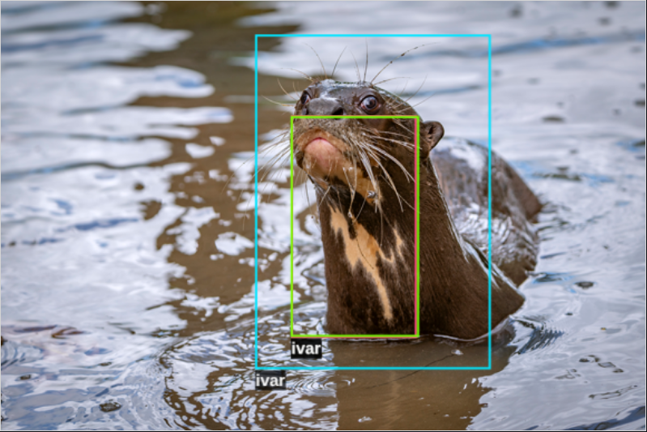
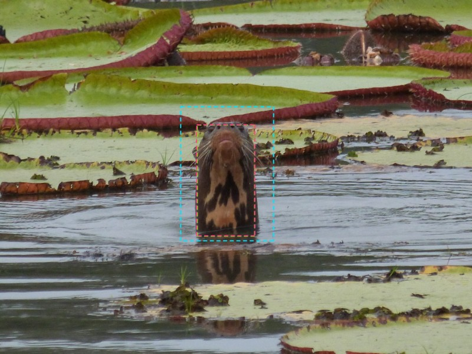
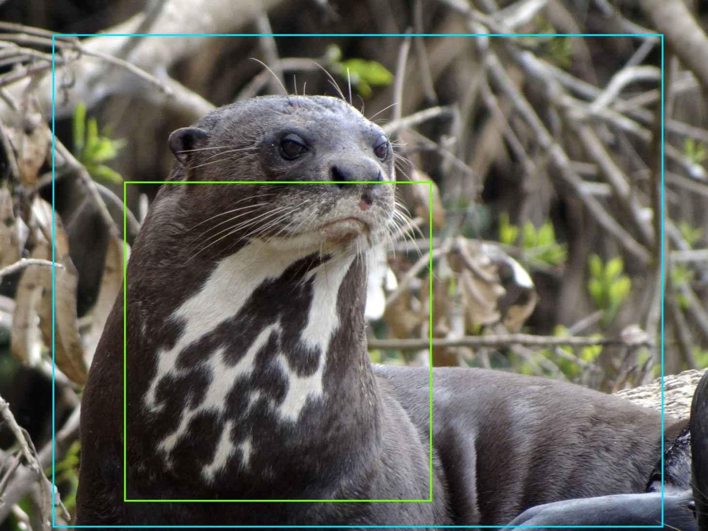
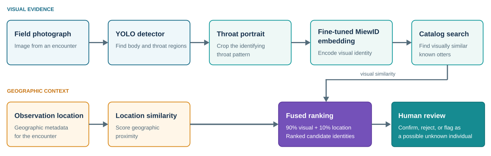
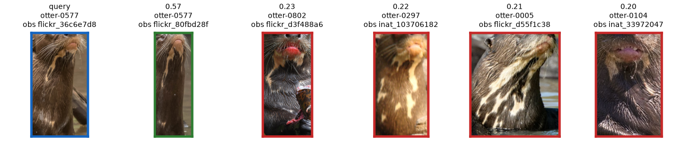
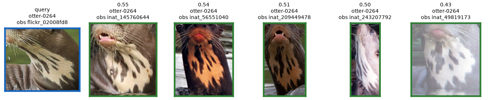
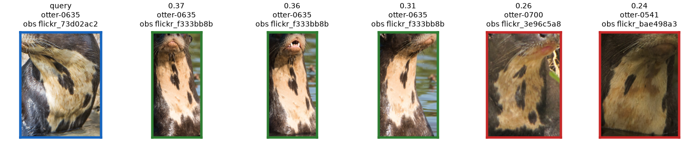
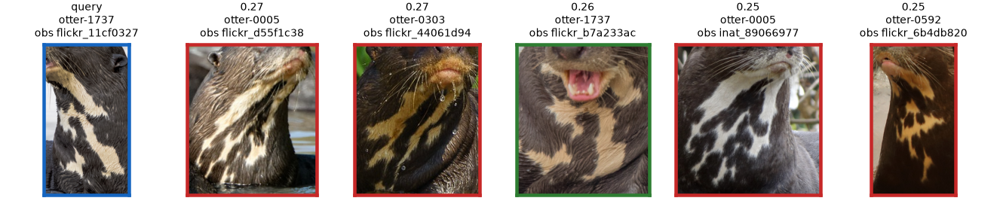
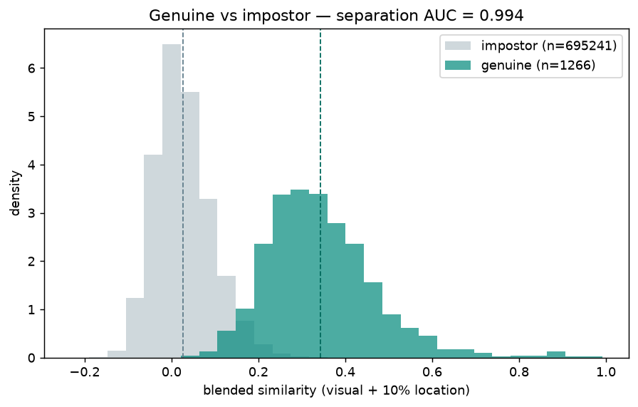
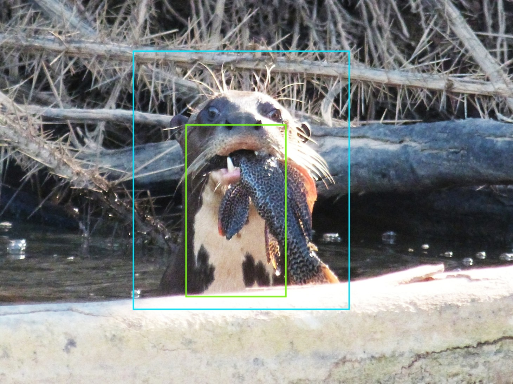

# Otter Spotter Evaluation

**Automated detection and individual re-identification of giant otters from field photographs**



This repository is a proof-of-concept computer-vision system for identifying individual giant otters (*Pteronura brasiliensis*) from their distinctive throat markings. The project evaluates an end-to-end workflow that:

1. Detects an otter and isolates a useful frontal throat portrait
2. Converts the portrait into a visual embedding
3. Compares that embedding with a catalog of known individuals
4. Combines visual similarity with geographic proximity to return ranked candidate matches

The results demonstrate the technical feasibility of detection and re-identification and support moving to a field pilot for human-in-the-loop identification assistance. The largest remaining risks concern ground-truth quality, field image quality, sparse histories, unknown-individual handling, and operational procedures for expert review.

## Key results

### Detection



Before an individual can be identified, the system must locate the animal and isolate its distinctive throat patch from field photographs. Evaluated on held-out encounters, the fine-tuned YOLO26 nano detector achieves the following performance on `throat_portrait` crops:

| Metric | Result |
| --- | ---: |
| Precision | **90.4%** |
| Recall | **86.2%** |
| mAP@50 | **95.6%** |

### Re-identification

Once a `throat_portrait` is cropped, the system extracts a visual embedding and ranks candidate matches against a catalog of known individuals. Using a fine-tuned [MiewID model](https://huggingface.co/conservationxlabs/miewid-msv3) that blends visual similarity with geographic proximity (90% visual, 10% location), retrieval across held-out encounters achieves:

| Metric | Result |
| --- | ---: |
| Rank-1 accuracy | **88.6%** |
| Rank-5 accuracy | **96.3%** |
| Rank-10 accuracy | **97.2%** |
| Mean average precision (mAP) | **81.0%** |


## Why throat portraits?



Giant otters have individually distinctive throat markings that can serve as a non-invasive biometric. In ordinary wildlife photographs, those markings may not be visible due to animal pose, they may be too small, or they may be obscured. We therefore distinguish among three crop types:

- `whole_body`: The entire visible animal
- `throat`: The throat region across a broad range of poses;
- `throat_portrait`: A tighter facial-and-throat view with a useful view of the identifying pattern

Using the generic pretrained MiewID model without location data, selecting `throat_portrait` rather than `whole_body` increased Rank-1 accuracy from **41.8% to 54.4%** and mAP from **28.2% to 40.0%**. This established `throat_portrait` crop selection as an important part of the identification pipeline.

## System overview



### Detection and cropping

The detector is a YOLO26 nano model operating at 640 × 640 input resolution. It predicts `whole_body`, `throat`, and `throat_portrait` bounding boxes. After a few hundred images were labeled manually, model-generated boxes with human review were used to accelerate further annotation.

The detector dataset was split by encounter, keeping all photographs from the same sighting in the same train, validation, or test partition. This prevents near-duplicate photographs from one encounter from leaking across splits.

| Split | Images | Encounters | Total annotations | `throat_portrait` annotations |
| --- | ---: | ---: | ---: | ---: |
| Train | 1,841 | 1,135 | 4,550 | 912 |
| Validation | 231 | 141 | 534 | 102 |
| Test | 230 | 140 | 559 | 107 |
| **Total** | **2,302** | **1,328** | **5,643** | **1,121** |

Held-out test performance:

| Class | Precision | Recall | mAP@50 | mAP@50–95 |
| --- | ---: | ---: | ---: | ---: |
| `whole_body` | 84.5% | 91.5% | 89.7% | 69.6% |
| `throat` | 94.4% | 95.7% | 99.2% | 74.4% |
| `throat_portrait` | 90.4% | 86.2% | 95.6% | 72.6% |
| **All classes** | **89.8%** | **91.1%** | **94.8%** | **72.2%** |

### Re-identification

The re-identification stage uses [MiewID](https://huggingface.co/conservationxlabs/miewid-msv3) to map each crop into an embedding space. A model pretrained for wildlife re-identification provides the baseline. A domain-specific version was fine-tuned on giant-otter throat portraits.

Catalog candidates are ranked using blended similarity:

```text
blended = (1 - alpha) * visual + alpha * location
```

The selected configuration uses `alpha = 0.10`, giving 90% of the weight to the visual embedding and 10% to geographic similarity. This light location weight improves retrieval while keeping visual similarity dominant.

## Data

The collected dataset contains **5,418 source images** from four sources:

- **Karanambu Collection** — A curated collection of identified giant otter photos taken near Karanambu Lodge, Guyana. The collection is organized by known individual and therefore particularly valuable for re-identification.
- **iNaturalist** — The most comprehensive source. Images are organized by encounter, and an encounter can contain one or more otters. Individual identities are not provided. Every encounter has a location, although coordinates for this sensitive species are obfuscated.
- **Flickr** — Contains many older photographs, including images that predate broad adoption of iNaturalist. Location metadata is often missing or unreliable.
- **Wikimedia Commons** — A small supplemental source, including some older images.

Only **1,105 of the 5,418 source images** contained at least one annotatable `throat_portrait`. Those images produced **1,181 re-identification crops** (because a photograph can contain multiple otters).

### Identity labeling

Except for the Karanambu Collection, source images did not include individual identities. Labeling therefore used a conservative, encounter-first process:

1. Every otter in each encounter was initially treated as a new individual and assigned a unique identifier
2. Similar individuals were subsequently compared across encounters, first manually and later with assistance from early versions of the re-identification model
3. Identifiers were merged only when the throat pattern and available location evidence supported a clear match

This process favors avoiding incorrect merges, but it likely leaves **false non-matches**: photographs of the same individual may remain assigned to separate identities when pose, resolution, occlusion, or missing context prevents a confident manual match. In some cases this may occur even among photographs from the same encounter.

## Evaluation protocol

Re-identification uses a **closed-set, leave-one-encounter-out** retrieval protocol with same-encounter exclusion:

- Each query is evaluated against a gallery that excludes all images from the query's own encounter
- Individuals with at least two encounters provide evaluable queries
- Individuals observed in only one encounter remain in the gallery as distractors
- Ranking metrics report whether the known correct identity appears at Rank 1, within the top 5, or within the top 10

For `throat_portrait`, the benchmark contains 1,181 crops from 1,105 images and 841 encounters. It includes 757 catalog identities: 110 evaluable identities with at least two encounters and 647 single-encounter distractor identities. The resulting random Rank-1 baseline is 0.47%.

This protocol is harder and more realistic than matching against photographs from the same encounter, where environment, lighting conditions, and animal pose are more likely to be consistent.

## Re-identification results

### Example query results

In the examples below, the blue border indicates the query image, green borders indicate correct identity matches from other encounters, and red borders indicate non-matches:






### Cumulative improvements

| Stage | Configuration | Rank-1 | Rank-5 | Rank-10 | mAP |
| --- | --- | ---: | ---: | ---: | ---: |
| Generic baseline | Pretrained MiewID, `whole_body`, image only | 41.8% | 54.0% | 59.9% | 28.2% |
| Targeted crop | Pretrained MiewID, `throat_portrait`, image only | 54.4% | 70.2% | 76.2% | 40.0% |
| Include location | Pretrained MiewID, `throat_portrait`, 90/10 fusion | 66.1% | 82.1% | 88.3% | 52.1% |
| **Domain fine-tuning** | **Fine-tuned MiewID, `throat_portrait`, 90/10 fusion** | **88.6%** | **96.3%** | **97.2%** | **81.0%** |

Domain-specific fine-tuning produced the largest single improvement. On throat portraits, it increased image-only Rank-1 accuracy by **28.5 percentage points**.

### Effect of location

| Location weight (`alpha`) | Fine-tuned Rank-1 | Fine-tuned mAP |
| ---: | ---: | ---: |
| 0.00 | 82.9% | 72.6% |
| 0.05 | 87.7% | 79.0% |
| **0.10 (selected)** | **88.6%** | **81.0%** |
| 0.15 | 88.8% | 81.4% |
| 0.20 | 88.3% | 80.7% |
| 0.30 | 87.3% | 78.7% |
| 0.50 | 84.9% | 75.5% |

Even fuzzy public coordinates provide useful information. The evaluation does not yet measure how much precise GPS or a temporal-spatial movement model would add; those remain hypotheses for a field pilot.

### Effect of catalog history

Retrieval generally improves for individuals represented by more independent encounters and more throat portraits.

| Independent encounters | Individuals | Queries | Rank-1 with location | Rank-5 with location |
| --- | ---: | ---: | ---: | ---: |
| 2 | 66 | 160 | 81.2% | 93.8% |
| 3–4 | 27 | 125 | 89.6% | 96.8% |
| 5–9 | 12 | 101 | 93.1% | 97.0% |
| 10+ | 5 | 77 | 96.1% | 100.0% |

| Throat-portrait images | Individuals | Queries | Rank-1 with location | Rank-5 with location |
| --- | ---: | ---: | ---: | ---: |
| 2 | 48 | 96 | 79.2% | 90.6% |
| 3–4 | 34 | 110 | 84.5% | 96.4% |
| 5–9 | 18 | 121 | 89.3% | 96.7% |
| 10+ | 10 | 136 | 97.8% | 100.0% |

The high-history groups contain few individuals, and image count is entangled with encounter diversity, pose coverage, image quality, geography, and other factors. One plausible explanation for the gains is that matching is easier between similar poses, and more images improve pose coverage, but the current benchmark does not isolate that effect.

## Match scores and human review



Similarity scores can support triage, but they are not calibrated probabilities. In the current benchmark, correct top matches have a mean similarity of 0.441, while the hardest incorrect candidates have a mean similarity of 0.287. Their distributions overlap.

| Threshold | True-match recall | Incorrect-candidate rejection |
| ---: | ---: | ---: |
| 0.25 | 94.8% | 22.0% |
| 0.30 | 86.8% | 63.3% |
| 0.35 | 71.3% | 90.9% |
| 0.40 | 55.1% | 98.9% |
| 0.45 | 38.7% | 100.0% |

The appropriate threshold depends on the operational cost of a missed known individual versus an incorrect suggested match. Presuming that the model will be used to assist a human reviewer, threshold values can define confidence bands (eg. "Possible Match", "Likely Match").

## What the evaluation demonstrates

- A lightweight detector can locate and crop the frontal throat region needed for identification
- Giant-otter throat patterns are a strong re-identification signal
- Domain-specific fine-tuning substantially outperforms a generic wildlife re-identification model
- Even imprecise geographic information improves candidate ranking
- Ranked candidates are promising for a human-in-the-loop workflow: the correct known identity appears in the top five in 96.3% of evaluated queries

Together, these results justify a pilot using independently verified identities and purpose-collected field imagery.

## Limitations and threats to validity



### Reconstructed ground truth and circular verification bias

An ideal dataset would use identifications made by an independent expert catalog.  Without such a catalog, most identities in the benchmark were reconstructed from sources that did not provide identities. Early model results helped locate some potential cross-encounter matches, so the model is partly evaluated against clusters it helped create. At the same time, conservative merging likely leaves false non-matches in the catalog. Both effects can distort measured performance.

### Selection bias and image quality

Only 1,105 of 5,418 collected photographs supported a `throat_portrait` annotation, and many usable crops still have low resolution, partial occlusion, poor pose, or poor lighting. The source photographers generally were not trying to produce re-identification evidence.

### Sparse and uneven histories

Few individuals have large image or encounter histories. Only 110 of 758 unique individuals appeared in more than one encounter. This is a relatively small population for training and evaluation.

Performance estimates for high-history groups are therefore based on small numbers of individuals and may not generalize to a broader census catalog.

### Imprecise location data

Public-source coordinates are frequently absent, unreliable, or deliberately obfuscated. The benchmark demonstrates the value of coarse geography, not the value of precise GPS or temporal-spatial filtering. A pilot should evaluate whether accurate locations can safely support finer-scale candidate filtering and movement analysis.

## Reproducibility

Repository structure:
```text
├── data/              # Snapshots of encounter and label data
│   └── sources/       # Tools for retrieving data from sources (e.g. iNaturalist, Flickr)
├── scripts/           # Scripts for training and evaluation
└── src/
    ├── detect/        # Source code for training YOLO26 detector
    ├── identify/      # Source code for training MiewID re-identification model
    └── web/           # Source code for web-based labeling and comparison tools
```

A snapshot of observations and data labels is present in data/sources/, but images must be fetched:

```text
# iNaturalist
uv run python data/sources/inat/download_inaturalist_images.py \
  data/sources/inat/inaturalist_results.csv

# Flickr (Requires API key. See data/sources/flickr/README.md)
uv run python data/sources/flickr/download_flickr_images.py \
  data/sources/flickr/search_results_giant-river-otter.json
uv run python data/sources/flickr/download_flickr_images.py \
  data/sources/flickr/search_results_pteronura-brasiliensis.json

# Wikimedia
uv run python data/sources/wikimedia/download_wikimedia_images.py \ 
  data/sources/wikimedia/search_results_giant-river-otter.json \
  data/sources/wikimedia/search_results_pteronura-brasiliensis.json
```

Run training scripts:
```
./scripts/train_detector.sh
./scripts/train_miewid.sh
```

Generate embeddings with re-identification model:

```
uv run python src/identify/miewid/extract_embeddings.py
```

Run web tool for labeling and browsing data:

```
uv run streamlit run src/web/app.py
```

## Intended use

This system is intended for conservation decision support. Its primary role is to narrow the search space for reviewers by presenting candidate identities and supporting evidence. The system should not be used to automate consequential catalog changes without human review, or infer the absence or movement of individuals beyond what the collection protocol and validated model support.

## Project status

**Proof of concept complete; field pilot recommended.**

The detector and re-identification results establish technical feasibility. Independent validation, field capture testing, and operating procedures for safe data collection and human review are the next steps.
